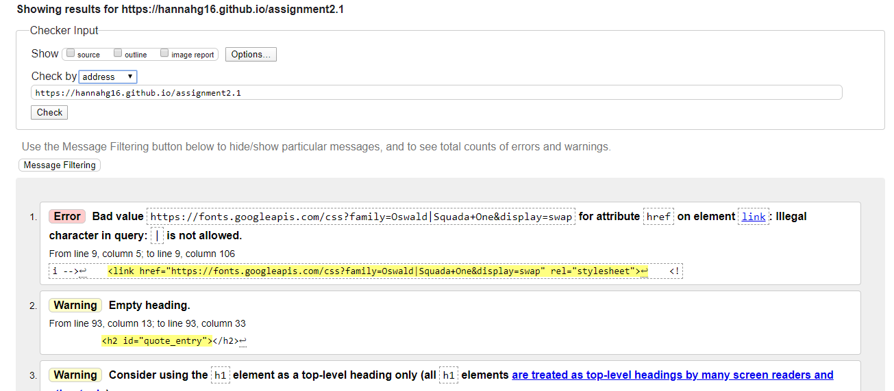
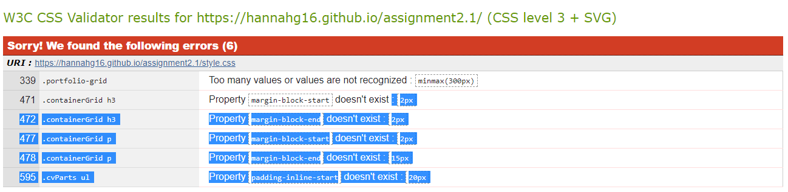
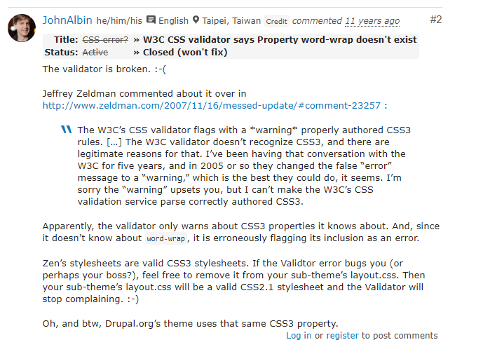
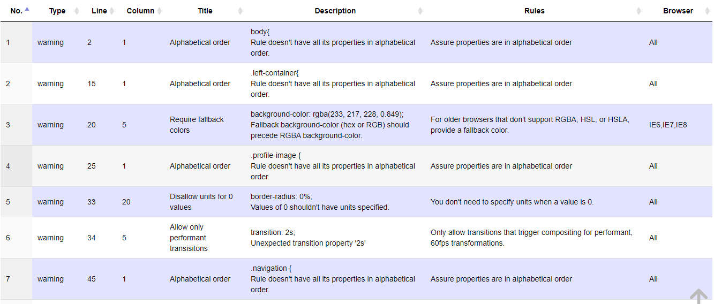
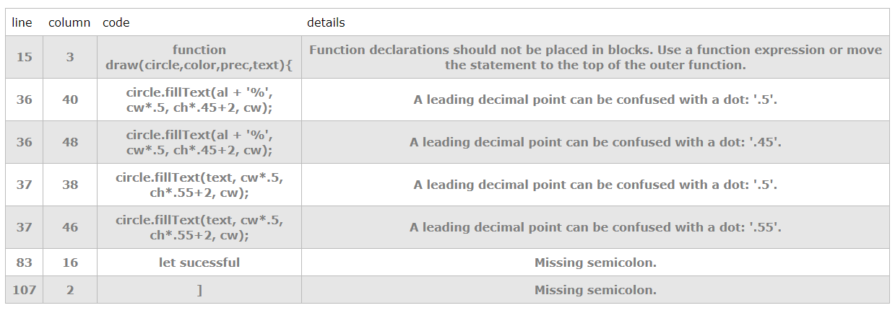
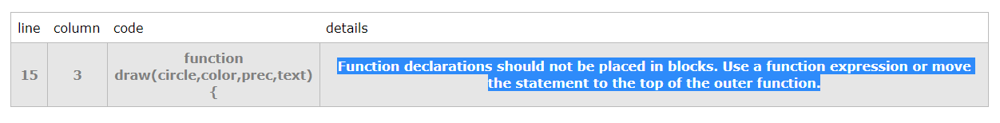

# assignment2.1

### Professional Profile Links
- GitHub 	https://github.com/HannahG16
- Twitter	https://twitter.com/hannahgoodridg1
- Stack Overflow	https://stackoverflow.com/users/12774038/han24072018?tab=profile
- Dev 	https://dev.to/hannahg16
- LinkedIn https://www.linkedin.com/feed/?trk=guest_homepage-basic_sign-in-submit

### Github Sync Evidence
This is my contribution grid from my github account;

This is evidence of me syncing my work to github consistantly from the begining of term;

### Code Validation 

To check that there are no errors within my code I put it into the W3C validator which looks through your document to find any errors within the code allowing the user to fix the issues which appear.  

**HTML**

When I put my code through the HTML validator it came up with the following errors;

The first error which appeared I had received previously in my assignment 1 validation and concerned the google fonts api link. The error was stating the line character is illegal. I went into my code and attempted to change the line to a different character however when viewed it wouldn’t work. I was unsure about changing it because it was copied from the google fonts website as a reference which sourced the fonts through this link. I decided to leave it the same because it works and doesn’t affect the look of the website.

The second warning to appear was that there was an empty heading 2 tag, this is being used within the random quote generator to hold the quote which is generated when the click me button is pressed. This wont need to hold any text as it should only show the quote when the user clicks. I decided to leave the empty h2 tag because it was necessary for the required code to be held within. 

The third warning was about only having the h1 tag as the heading only and not used for other elements, after researching I discovered this was due to search engines penalising websites for having more and one h1 tag per page in regard to search engine optimisation. As my site isn’t being used in this manor I decided to leave the tags as the same, however keeping this in mind when designing and building websites in the future. 

**CSS**

I then ran my site through the CSS validator which is also present on W3C to check my CSS code. It came back that some of the values weren’t recognised within the CSS such as the minmax and the margin-block-start. I didn’t understand what this meant because they make a difference on the user interface when removing them from the code meaning they do exist else they wouldn’t be changing anything on the page. 

When I investigated futher I founf multiple comments like this one shown below which states that it doesn’t check for the latest version of CSS even though it does say this, this means that that property doesn’t exist in the earlier versions so is therefore picking up on this when validating. 

I found another online validator to check my CSS code, no errors were shown only warnings which could happen. One of these includes the alphabetical order of the properties within their containing elements. This can be sorted by reordering the properties within the classes, so they are in alphabetical order. Another warning was concerning using rgba colours, older browsers might not support using rgba so having a fallback colour using rgb can make sure the colour stays the same in older browsers. Another warning was not to include any values with a 0% border radius as they is the default value, however I have used this to change the image border radius from 10% to 0% when hovered over, I couldn’t find another way to complete this without stating the border radius as 0% so have kept this the same. The last waring received was to only allow transitions under 60fps meaning it is very slow, I have changed this to 0.5s within my code to allow a faster transition speed allowing the user to see it more effectively.  

**JavaScript**

When I put JavaScript file through an online validator the following errors were shown;

The easiest error to fix was the missing semicolons, there were two missing from within the file, I went into my code and put them in where they were missing. The second error was that putting .5 numbers rather than 0.5 can cause confusion and could potentially miss lead people into thinking they were dots, this again was easy to solve, and I just put a 0 Infront of the decimal points, this fixed this error. The first error concerns the function which draws the circles to show the skills I hold. I took this function from an existing codepen project and changed it to fit with the style I wanted. The error is concerned with putting the second function within the block of the first one which makes the code more complicated. This should be declared outside the block and used within the other function. Although I understand the JavaScript used within this function I couldn’t work out how to change the function to fix this error without breaking the code. This is something I’m going to investigate further and attempt to fix in the future. I put my code back through the code validator and the only error present was the function error which I expected.  

### Wireframes