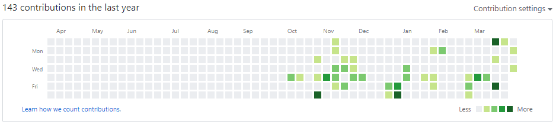

# assignment2.1

### Professional Profile Links
- GitHub 	https://github.com/HannahG16
- Twitter	https://twitter.com/hannahgoodridg1
- Stack Overflow	https://stackoverflow.com/users/12774038/han24072018?tab=profile
- Dev 	https://dev.to/hannahg16
- LinkedIn https://www.linkedin.com/feed/?trk=guest_homepage-basic_sign-in-submit

### Github Sync Evidence
This is my contribution grid from my github account;

This is evidence of me syncing my work to github consistantly from the begining of term;

### Code Validation 

To check that there are no errors within my code I put it into the W3C validator which looks through your document to find any errors within the code allowing the user to fix the issues which appear.  

**HTML**
When I put my code through the HTML validator it came up with the following errors;

The first error which appeared I had received previously in my assignment 1 validation and concerned the google fonts api link. The error was stating the line character is illegal. I went into my code and attempted to change the line to a different character however when viewed it wouldn’t work. I was unsure about changing it because it was copied from the google fonts website as a reference which sourced the fonts through this link. I decided to leave it the same because it works and doesn’t affect the look of the website.

The second warning to appear was that there was an empty heading 2 tag, this is being used within the random quote generator to hold the quote which is generated when the click me button is pressed. This wont need to hold any text as it should only show the quote when the user clicks. I decided to leave the empty h2 tag because it was necessary for the required code to be held within. 

The third warning was about only having the h1 tag as the heading only and not used for other elements, after researching I discovered this was due to search engines penalising websites for having more and one h1 tag per page in regard to search engine optimisation. As my site isn’t being used in this manor I decided to leave the tags as the same, however keeping this in mind when designing and building websites in the future. 
